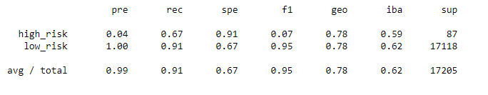
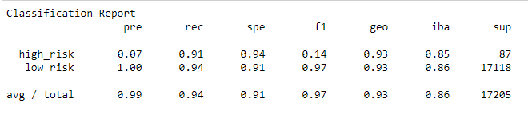

# Credit_Risk_Analysis

There are many different factors involved in trying to quantify credit risk. Several variables could be involved in highlighting a potential account to be at risk of defaulting, such as the balance owing, the amount of installment, home ownership, and more. 

# Overview

The goal of this analysis to build and evaluate several machine learning models to try and predict credit risk. Being able to predict credit risk with machine learning algorithms is an opportunity to really identify what good loan candidates have in common, and will result in more faster and reliable loan offerings with lower default rates. 

Three different machine learning models will be used to try and predict credit risk. Resampling models, the SMOTEENN algorithm, and the use of Ensemble Classifiers will all be used to determine which model performs the best at determining credit risk.

# Results

## Resampling Models
There were three different resampling models used on our dataset. The first  and second techniques used were taking advantage of oversampling - RandomOverSampler and SMOTE algorithms. Then to test a third resampling model, the undersampling algorithm - ClusterCentroids was tested. To evaluate the performance of these models, the balance accuracy score, confusion matrix and classification report were calculated.

### Random Oversampling
- Balanced Accuracy score - 66.13%
- Precision for high risk loans is very low at 1%, but low-risk loans are precise at 100%
- Recall is 66% for high risk, and for low risk a close 67%
### Figure 1 - Random Oversampling Imbalanced Classification Report
</img>

### SMOTE Oversampling
- Balanced Accuracy score - 63%
- Precision for high_risk is very low at 1%, but low-risk loans are precise at 100%
- Recall is 62% for high risk loans, low risk loans at 64%
### Figure 2 - SMOTE Oversampling
</img>

### Cluster Centroids Undersampling
- Balanced Accuracy score - 51%
- Precision for high_risk is very low at 1%, but low-risk loans are precise at 100%
- Recall is 59% for high risk loans, but not as sensitive for low risk loans being at 43%
### Figure 3 - Cluster Centroids Undersampling Imbalanced Classification Report
</img>

## The SMOTEENN algorithm
Another sampling method, but this is testing a combination of over- and undersampling algorithm to determine it produces the best performance.

- Balanced Accuracy score - 63.75%
- Similar to the other 3 sampling models the precision is very low for the high risk loans (1%), where low risk is precise at 100%
- Recall on high risk loans is showing a 70% of finding all positive samples, but only 57% for finding low risk
### Figure 4 - SMOTEENN Algorithm Classification Report
</img>

# Ensemble Learners
## Balanced Random Forest Classifier
- Balanced Accuracy score - 78.78%
- Similar to the other 3 sampling models the precision is very low for the high risk loans (4%), where low risk is precise at 100%
- Recall on high risk loans is showing a 67% of finding all positive samples, and a 91% for finding low risk loans

### Figure 5 - Balanced Random Forest Classifier
</img>

## Easy Ensemble AdaBoost Classifier
- Balanced Accuracy score - 92.54%
- Similar to the other 3 sampling models the precision is very low for the high risk loans (7%), where low risk is precise at 100%
- Recall on high risk loans is showing a the highest of all methods tested - a 91% of finding all positive samples, and 94% for finding low risk
### Figure 6 - Easy Ensemble AdaBoost classifier
</img>

# Summary

Out of all the sampling models, the random oversampling technique provided the most accurate of the three, and while all three had incredibly low precision, random oversampling still gave the highest recall. 

But in comparison to the Ensemble Learner methods, these machine learning methods resulted in much higher accuracy models. With Random Forest having an accuracy score of 78% and AdaBoost coming at 93%. 

But in terms of using which model to use out of all models tested in this analysis, the Easy Ensemble AdaBoost gave the best F1 values, and scored the highest accuracy. 