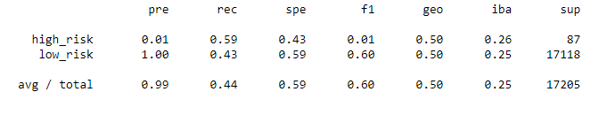

# Credit_Risk_Analysis

Using your knowledge of the imbalanced-learn and scikit-learn libraries, you’ll evaluate three machine learning models by using resampling to determine which is better at predicting credit risk. First, you’ll use the oversampling RandomOverSampler and SMOTE algorithms, and then you’ll use the undersampling ClusterCentroids algorithm. Using these algorithms, you’ll resample the dataset, view the count of the target classes, train a logistic regression classifier, calculate the balanced accuracy score, generate a confusion matrix, and generate a classification report.

Overview of the analysis: Explain the purpose of this analysis.

Results: Using bulleted lists, describe the balanced accuracy scores and the precision and recall scores of all six machine learning models. Use screenshots of your outputs to support your results.
### Figure 1 - Linear Regression Model with Multiple Metrics on MPG
</img>

### Figure 1 - Linear Regression Model with Multiple Metrics on MPG
</img>

### Figure 1 - Linear Regression Model with Multiple Metrics on MPG
</img>

### Figure 1 - Linear Regression Model with Multiple Metrics on MPG
</img>

Summary: Summarize the results of the machine learning models, and include a recommendation on the model to use, if any. If you do not recommend any of the models, justify your reasoning.